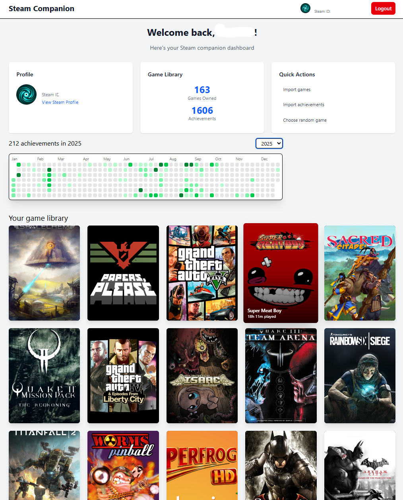

# Steam Companion

A full-stack application for managing and tracking your Steam game library, achievements, and statistics.

## 🏗️ Architecture

This project consists of three main components:

- **Backend**: Spring Boot 4 REST API built with Kotlin
- **Frontend**: React 19 with TypeScript, Vite, and TailwindCSS
- **CI/CD**: GitHub Actions for automated building, testing, and deployment

## 📋 Prerequisites

### Backend

- Java 25 (JDK)
- PostgreSQL 18
- Gradle (wrapper included)
- Steam API Key

### Frontend

- Node.js 18+
- pnpm (recommended) or npm

### Deployment

- Docker & Docker Compose
- DockerHub account (for CI/CD deployment)

## 🚀 Quick Start

### 1. Backend Setup

#### Using Docker Compose (Recommended)

```bash
cd backend

# Start PostgreSQL database
docker-compose up -d

# Set required environment variables
export STEAM_API_KEY=your_steam_api_key_here

# Run the application
./gradlew bootRun
```

The backend API will be available at `http://localhost:8080` |

### 2. Frontend Setup

```bash
cd frontend

# Install dependencies
pnpm install

# Start development server
pnpm dev
```

The frontend will be available at `http://localhost:5173`

#### Available Scripts

- `pnpm dev` - Start development server with hot reload
- `pnpm build` - Build for production
- `pnpm preview` - Preview production build locally
- `pnpm lint` - Run ESLint

## 🔄 CI/CD Pipeline

The project uses GitHub Actions for continuous integration and deployment. The workflow is defined in `.github/workflows/ci.yml`.

### Workflow Overview

The pipeline runs on pushes to `main`, pull requests, and manual dispatch. It has three jobs:

#### 1. Backend Job

- Sets up JDK 25 with Gradle caching
- Builds and tests the backend with `./gradlew clean build` (integration tests start Postgres with Testcontainers)
- Uploads the test reports if the build fails, and the JAR artifact for the deploy job

#### 2. Frontend Job

- Installs dependencies with pnpm (`--frozen-lockfile`)
- Runs `pnpm lint`, `pnpm test` (Vitest) and `pnpm build`

#### 3. Deploy Job

- Runs only on `main` (never for pull requests), after the backend job succeeds
- Downloads the JAR artifact and builds a Docker image
- Pushes it to DockerHub with two tags: `<build date>-<short commit SHA>` (e.g. `20260929153012-a1b2c3d`) and `latest`. The date prefix lets Flux pick the newest image; the SHA shows which code it contains
- The image runs as a non-root user on a JRE base image. The heap is 50% of the container's memory limit (the rest covers the JVM's non-heap memory); override it with the `JAVA_TOOL_OPTIONS` environment variable

### Required GitHub Secrets

Configure these secrets in your repository settings (Settings → Secrets → Actions):

| Secret               | Description             |
| -------------------- | ----------------------- |
| `DOCKERHUB_USERNAME` | Your DockerHub username |
| `DOCKERHUB_TOKEN`    | DockerHub access token  |

### Manual Deployment

You can trigger a deployment manually from the GitHub Actions tab using the "workflow_dispatch" event.

## 🧪 Testing

### Backend Tests

```bash
cd backend

# Run all tests
./gradlew test
```

### Frontend Tests

```bash
cd frontend

# Run all tests (Vitest)
pnpm test
```

## UI


